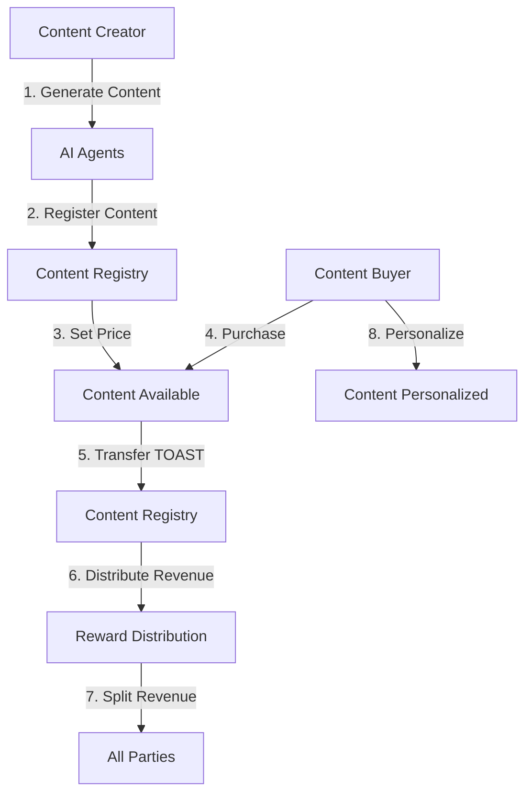

# Burnie Content Marketplace - Web3 Smart Contracts

[](https://soliditylang.org/)
[](https://hardhat.org/)
[](https://www.typescriptlang.org/)
[](https://somnia.network/)

## 🎯 Business Overview

**Burnie** is a decentralized content marketplace that revolutionizes how AI-generated content is created, distributed, and monetized. This repository contains the core Web3 smart contracts that power the platform's blockchain infrastructure.

### 🚀 Key Business Value Propositions

- **🎨 AI Content Creation**: Decentralized nodes generate personalized content using advanced AI agents
- **💰 Fair Revenue Distribution**: Automated revenue sharing between creators, evaluators, and platform
- **🔗 Referral System**: Multi-tier referral program with automatic payouts
- **🛡️ Content Ownership**: Blockchain-based ownership tracking and transfer
- **⚡ High Performance**: Built on Somnia Network for low-latency, cost-efficient transactions

## 🏗️ Architecture Overview

The platform consists of three main user types:

### 1. **Content Creators/Miners** 🎨
- Generate AI content using specialized agents
- Set pricing for their content
- Earn 50% of purchase revenue
- Can personalize content for buyers

### 2. **Content Buyers/Yappers** 💰
- Purchase content with TOAST tokens
- Can personalize purchased content
- Participate in referral programs
- Access premium AI-generated content

### 3. **Web3/Web2 Projects** 🌐
- Integrate Burnie's content marketplace
- Access decentralized content generation
- Benefit from automated revenue distribution

## 📋 Smart Contracts

### 🪙 TOAST Token (`TOASTToken.sol`)
**Purpose**: ERC-20 utility token for the Burnie ecosystem

**Key Features**:
- Fixed supply of 1 billion tokens
- Burnable and pausable functionality
- Anti-whale protection
- Gaming rewards integration
- Staking capabilities

**Business Value**:
- Primary payment method for content purchases
- Incentivizes platform participation
- Enables decentralized governance

### 📄 Content Registry (`ContentRegistry.sol`)
**Purpose**: Manages content ownership, availability, and personalization

**Key Features**:
- Content registration and approval workflow
- Ownership tracking and transfer
- Personalization status management
- Integration with reward distribution
- Pausable for emergency situations

**Business Value**:
- Ensures content authenticity and ownership
- Enables seamless content trading
- Provides transparency in content lifecycle

### 💰 Content Reward Distribution (`ContentRewardDistribution.sol`)
**Purpose**: Automated revenue distribution system

**Revenue Split**:
- **50%** → Content Creator (Miner)
- **20%** → Evaluator Treasury (Quality Control)
- **30%** → Platform Treasury (Operations)
  - **5-10%** → Direct Referrer (based on tier)
  - **2.5-5%** → Grand Referrer (based on tier)
  - **Remainder** → Platform Revenue

**Referral Tiers**:
- **Silver**: 5% direct, 2.5% grand
- **Gold**: 7.5% direct, 3.75% grand
- **Platinum/Emerald/Diamond/Unicorn**: 10% direct, 5% grand

**Business Value**:
- Fair compensation for all stakeholders
- Automated, transparent revenue sharing
- Incentivizes quality content and referrals

## 🛠️ Technical Stack

- **Solidity**: ^0.8.22 (Smart contracts)
- **Hardhat**: ^2.20.1 (Development framework)
- **TypeScript**: ^5.3.3 (Scripts and tests)
- **OpenZeppelin**: ^5.0.2 (Security standards)
- **Ethers.js**: ^6.11.1 (Blockchain interaction)
- **Chai**: ^4.4.1 (Testing framework)

## 🚀 Quick Start

### Prerequisites
- Node.js (v18+ recommended)
- npm or yarn
- Git

### Installation
```bash
# Clone the repository
git clone <repository-url>
cd burnie-web3-contracts

# Install dependencies
npm install

# Compile contracts
npm run compile
```

### Environment Setup
Create a `.env` file in the root directory:
```env
# Somnia Network Configuration
SOMNIA_TESTNET_RPC_URL=https://dream-rpc.somnia.network
SOMNIA_MAINNET_RPC_URL=https://mainnet-rpc.somnia.network

# Private Keys (for deployment and testing)
PRIVATE_KEY_OWNER=your_owner_private_key_here
PRIVATE_KEY_USER1=your_user1_private_key_here
PRIVATE_KEY_USER2=your_user2_private_key_here
PRIVATE_KEY_USER3=your_user3_private_key_here

# Contract Addresses (populated after deployment)
TOAST_TOKEN_ADDRESS=
CONTENT_REGISTRY_ADDRESS=
REWARD_DISTRIBUTION_ADDRESS=

# Treasury Addresses
EVALUATOR_TREASURY=your_evaluator_treasury_address
PLATFORM_TREASURY=your_platform_treasury_address

# Somnia Explorer API
SOMNIA_EXPLORER_BASE_URL=https://somnia.w3us.site/api/v2/
SOMNIA_EXPLORER_API_KEY=

# Etherscan API Keys (for verification)
ETHERSCAN_API_KEY=
SOMNIA_API_KEY=empty
```

## 📜 Available Scripts

### 🧪 Testing
```bash
npm test                    # Run all tests
npm run test:toast         # Test TOAST token
npm run test:registry      # Test Content Registry
npm run test:rewards       # Test Reward Distribution
npm run test:content      # Test content contracts
npm run test:workflow     # Test full workflow
```

### 🚀 Deployment
```bash
# Deploy all contracts to testnet
npm run deploy:all:testnet

# Deploy individual contracts
npm run deploy:toast:testnet
npm run deploy:content:testnet
npm run deploy:rewards:testnet

# Deploy to mainnet
npm run deploy:all:mainnet
```

### 🔍 Verification
```bash
# Verify all contracts
npm run verify:all:testnet

# Verify individual contracts
npm run verify:toast:testnet
npm run verify:content:testnet
npm run verify:rewards:testnet
```

### 🔄 Interaction & Testing
```bash
# Run full workflow on Somnia testnet
npm run workflow:somnia

# Interact with contracts
npm run interact:toast:testnet
npm run interact:content:testnet
npm run interact:rewards:testnet
```

## 🧪 Testing

The repository includes comprehensive test suites:

### Test Coverage
- **TOAST Token**: 15+ tests covering minting, burning, transfers, and access control
- **Content Registry**: 23+ tests covering registration, approval, purchase, and personalization
- **Reward Distribution**: 21+ tests covering referral registration, payout calculation, and revenue distribution
- **Full Workflow**: End-to-end integration tests

### Running Tests
```bash
# Run all tests
npm test

# Run with coverage
npm run test:coverage

# Run with gas reporting
npm run test:gas
```

## 🌐 Network Configuration

### Somnia Testnet
- **RPC URL**: `https://dream-rpc.somnia.network`
- **Chain ID**: `50312`
- **Explorer**: `https://somnia.w3us.site`
- **Native Token**: STT (for gas fees)

### Somnia Mainnet
- **RPC URL**: `https://mainnet-rpc.somnia.network`
- **Chain ID**: `TBD`
- **Explorer**: `https://somnia.w3us.site`

## 📊 Contract Addresses (Testnet)

| Contract | Address | Status |
|----------|---------|--------|
| TOAST Token | `0x24dAeA2E04497e7894D7E0b3761A09B88700Cc9D` | ✅ Verified |
| Content Registry | `0x8319877ed76390EbcC069eBf7Be1C9EC3E158E5c` | ✅ Verified |
| Reward Distribution | `0xe1472DF839155CCB8987418EB5102Ea1f2eb783D` | ✅ Verified |

## 🔄 Content Marketplace Workflow



## 🛡️ Security Features

- **OpenZeppelin Standards**: Using battle-tested security patterns
- **Reentrancy Protection**: Prevents reentrancy attacks
- **Access Control**: Role-based permissions
- **Pausable Contracts**: Emergency stop functionality
- **Input Validation**: Comprehensive parameter checking
- **Gas Optimization**: Efficient contract design

## 📈 Revenue Model

### Content Purchase Flow
1. **Buyer** purchases content with TOAST tokens
2. **Revenue** is automatically distributed:
   - 50% to Content Creator
   - 20% to Evaluator Treasury
   - 30% to Platform Treasury
3. **Referral bonuses** are deducted from platform share
4. **Remaining** goes to platform operations

### Referral System
- **Multi-tier** referral structure
- **Automatic** payout calculation
- **Tier-based** commission rates
- **Transparent** reward distribution

## 🔧 Development

### Project Structure
```
web3/
├── contracts/           # Smart contracts
├── scripts/            # Deployment and interaction scripts
├── test/              # Test suites
├── artifacts/         # Compiled contracts
├── cache/             # Hardhat cache
├── typechain-types/   # TypeScript type definitions
└── docs/              # Documentation
```

### Contributing
1. Fork the repository
2. Create a feature branch
3. Write tests for new functionality
4. Ensure all tests pass
5. Submit a pull request

## 📚 Documentation

- [TOAST Token Documentation](./TOAST_TOKEN_DOCUMENTATION.md)
- [Somnia Explorer Integration](./SOMNIA_EXPLORER_INTEGRATION.md)
- [Shannon API Integration](./SHANNON_API_INTEGRATION_COMPLETE.md)
- [Final Integration Status](./FINAL_INTEGRATION_STATUS.md)

## 🤝 Support

For technical support or business inquiries:
- **Documentation**: Check the `/docs` directory
- **Issues**: Open a GitHub issue
- **Discussions**: Use GitHub Discussions

## 📄 License

This project is licensed under the MIT License - see the [LICENSE](LICENSE) file for details.

## 🔗 Links

- **Somnia Network**: [https://somnia.network](https://somnia.network)
- **Somnia Explorer**: [https://somnia.w3us.site](https://somnia.w3us.site)
- **Burnie Platform**: [Coming Soon]

---

**Built with ❤️ for the decentralized content economy**